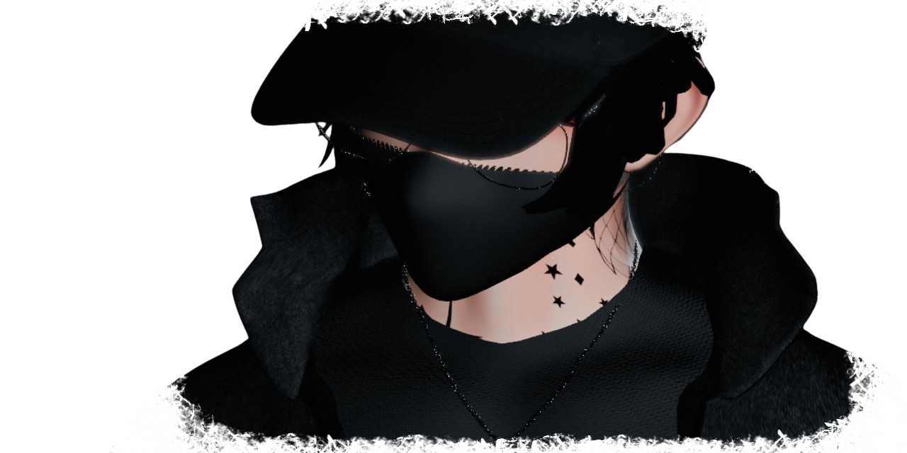

 <!-- ===== banner 42 start ===== -->

 

---

 

<!-- ===== banner 42 end ===== -->

<!-- ===== banner end ===== -->

<!-- ===== Profil banner end ===== -->

##

<!-- ===== stats ===== -->

<!-- ===== stats end ===== -->

<!-- ===== logo of abilities ===== -->

  
  
  
  
  
  
  
  
  

 

---

 

<!-- ===== logo of abilities end ===== -->

<!-- ===== cursus 42 picture ===== -->

###

 

---

 

<!-- ===== cursus 42 picture end ===== -->

  <!---->

###
